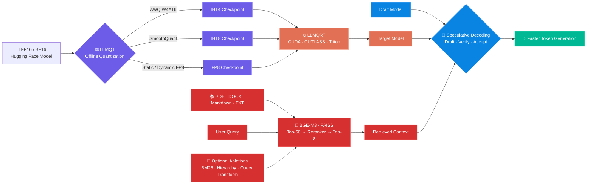
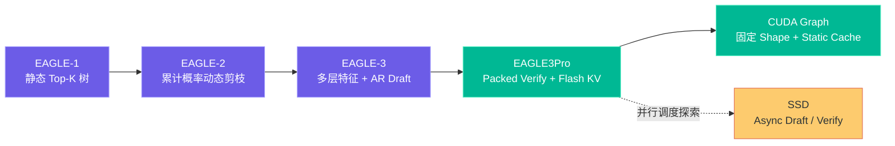
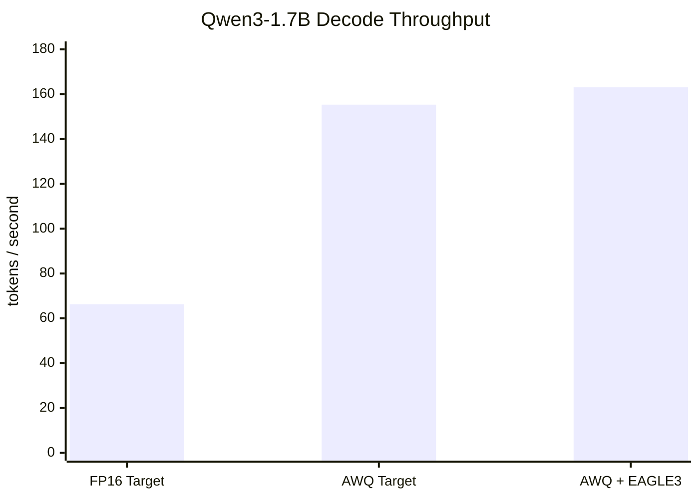

<div align="center">

# ⚡ LLM Inference Optimization Lab

### Quantization · CUDA Runtime · Speculative Decoding · RAG

从 **模型量化**、**低比特算子**、**EAGLE / SSD 推测解码** 到 **RAG 检索增强生成** 的端到端大模型推理实验仓库。

<p>
  
  
  
  
  
</p>

<p>
  <a href="#-项目概览">项目概览</a> ·
  <a href="#-核心能力">核心能力</a> ·
  <a href="#-性能亮点">性能亮点</a> ·
  <a href="#-快速开始">快速开始</a> ·
  <a href="#-目录结构">目录结构</a>
</p>

</div>

---

<table align="center">
  <tr>
    <td align="center"><b>🚀 2.46×</b><br><sub>吞吐提升</sub><br><sub>66.29 → 163.10 tok/s</sub></td>
    <td align="center"><b>💾 −52.1%</b><br><sub>引擎显存增量</sub><br><sub>4159 → 1994 MiB</sub></td>
    <td align="center"><b>✅ 1152 / 1152</b><br><sub>Token 严格一致</sub><br><sub>确定性验证路径</sub></td>
    <td align="center"><b>🧠 40.47%</b><br><sub>RAG Answer F1</sub><br><sub>Hit@8 86.00% · Faithfulness 79.67%</sub></td>
  </tr>
</table>

> [!NOTE]
> 上述吞吐与显存数据来自 RTX 4060 Laptop、Qwen3-1.7B、batch=1、固定生成 128 tokens 的吞吐优先配置。严格 Token 一致性来自另一组 batch-invariant + eager 配置；两组结果不可混为同一测试设置。详见[性能亮点](#-性能亮点)。
>
> RAG 数据来自 OHR-Bench 固定 100 题、Candidate Top-50、最终 Top-8、Qwen3-1.7B AWQ 的同后端消融。Faithfulness 由同一个 1.7B 模型担任 Judge，存在自评偏差，需用独立 Judge 或人工抽检复核。

## 🌌 项目概览

本仓库围绕 LLM 推理与知识增强构建四层技术栈：

1. **LLMQT**：将 FP16/BF16 模型转换为 AWQ W4A16、SmoothQuant INT8 或 FP8 模型。
2. **LLMQRT**：使用 CUDA、CUTLASS 与 Triton 实现低比特 GEMM/GEMV 和量化模型推理。
3. **Speculative Decoding**：实现 EAGLE-1/2/3、EAGLE3Pro 与 SSD，减少 Target Model 的串行解码轮数。
4. **RAG**：覆盖文档摄取、切块、Dense 检索、Reranker、生成、Faithfulness 与端到端评测；BM25/RRF、层次化检索、预设问题和查询变换作为可切换消融模块，并支持 vLLM HTTP 和本地 LLMQRT AWQ 两种生成后端。



## ✨ 核心能力

| 模块 | 能力 | 关键技术 | 入口 |
|---|---|---|---|
| **LLMQT** | 离线权重量化与校准 | AWQ、SmoothQuant、Static/Dynamic FP8 | [`LLMQT`](LLMQT) |
| **LLMQRT** | 量化模型加载与推理 | CUDA Extension、CUTLASS、Triton、低比特 GEMM/GEMV | [`LLMQRT`](LLMQRT) |
| **EAGLE-1** | 静态 Top-K 候选树 | Feature-conditioned Draft、Tree Verify | [`spec_decoding/eagle`](spec-decoding-src-code/spec-decoding-main/spec_decoding/eagle) |
| **EAGLE-2** | 动态候选树 | 累计概率 Beam、全局剪枝 | [`spec_decoding/eagle2`](spec-decoding-src-code/spec-decoding-main/spec_decoding/eagle2) |
| **EAGLE-3** | 多层特征 Draft | Multi-layer Features、Draft Vocabulary、KV Cache | [`spec_decoding/eagle3_sgl`](spec-decoding-src-code/spec-decoding-main/spec_decoding/eagle3_sgl) |
| **EAGLE3Pro** | 面向部署的优化实现 | Packed Verify、Flash KV、CUDA Graph、KV Compact | [`spec_decoding/eagle3pro`](spec-decoding-src-code/spec-decoding-main/spec_decoding/eagle3pro) |
| **SSD** | Draft / Verify 并行探索 | Async Speculation、Speculation Cache、独立 CUDA Stream | [`eagle_ssd`](spec-decoding-src-code/eagle_ssd) |
| **RAG** | 本地知识库检索、生成与严格消融 | BGE-M3、FAISS、Cross-Encoder Reranker、Faithfulness Judge、可选 BM25/RRF/层次化/查询变换 | [`RAG`](RAG) |

### 量化能力

| 方法 | 权重 / 激活 | 适合场景 | Runtime 路径 |
|---|---|---|---|
| **AWQ** | W4A16 | 显存敏感、单请求低延迟 | INT4 GEMM / GEMV、Marlin/CUTLASS |
| **SmoothQuant** | W8A8 | 权重与激活统一 INT8 | INT8 GEMM |
| **Static FP8** | FP8 + 离线 Scale | 稳定部署、固定校准分布 | Tensor-wise / Row-wise FP8 |
| **Dynamic FP8** | FP8 + 在线 Scale | 输入分布变化较大 | Dynamic Quant + FP8 GEMM |

代码中包含 Llama、Qwen2/Qwen3、Qwen3-MoE、DeepSeek 与 OPT 等模型适配；不同组合的完整验证状态以对应示例脚本为准。

### 推测解码演进



## 📊 性能亮点

### 吞吐优先：AWQ Marlin + CUDA Graph

测试环境：**RTX 4060 Laptop 8 GiB · Qwen3-1.7B · batch=1 · 128 output tokens · vLLM 0.26.0**。



| 配置 | 吞吐 | 相比 FP16 | 引擎显存增量 | TPOT |
|---|---:|---:|---:|---:|
| FP16 Target | 66.29 tok/s | 1.000× | 4159 MiB | 15.03 ms |
| AWQ Marlin Target | 155.32 tok/s | 2.343× | 1763 MiB | 6.35 ms |
| **AWQ Marlin + EAGLE3 (`k=1`)** | **163.10 tok/s** | **2.460×** | **1994 MiB** | **5.97 ms** |

关键结论：

- AWQ + Marlin 是主要收益来源：相较 FP16 Target 达到 **2.343×**。
- EAGLE3 在 AWQ Target 基线上进一步贡献 **5.01%** 吞吐提升。
- 完整方案相较 FP16 Target 的引擎显存增量降低 **52.06%**。
- 当前短文本、单并发负载下 `k=1` 最优；Speculative Tokens 并非越多越快。

<details>
<summary><b>查看 Speculative Token 扫描结果</b></summary>

| Speculative Tokens | 吞吐 | 相比 AWQ Target | 平均每轮推进 Token |
|---:|---:|---:|---:|
| `k=1` | **163.10 tok/s** | **+5.01%** | 1.534 |
| `k=2` | 158.11 tok/s | +1.80% | 1.733 |
| `k=3` | 155.14 tok/s | −0.12% | 1.837 |
| `k=5` | 137.29 tok/s | −11.61% | 1.887 |

随着 `k` 增大，接受长度上升，但更多 Draft Forward 和更宽的 Target Verify 会抵消收益。

</details>

### 严格一致：Batch-Invariant + Eager

为验证算法等价性，另一组实验禁用 CUDA Graph，并使用确定性 AWQ 反量化 + MatMul 路径：

| 配置 | 吞吐 | TPOT | E2E / 请求 | Token 一致性 |
|---|---:|---:|---:|:---:|
| AWQ INT4 Target | 22.17 tok/s | 45.03 ms | 5772.84 ms | Oracle |
| **AWQ INT4 + EAGLE3** | **29.03 tok/s** | **33.90 ms** | **4409.27 ms** | **1152 / 1152** |

- 吞吐提升 **30.92%**，TPOT 降低 **24.72%**。
- 三条固定 Prompt 重复三轮，完整 Token ID **1152 / 1152 严格一致**。
- 默认 Marlin + CUDA Graph 适合吞吐优先，但临界 Argmax 可能因数值路径差异产生 Token 分叉，不能直接宣称严格无损。

### RAG：全链路分阶段消融

数据集为 OHR-Bench（8,259 个有效页面、8,456 条可评测问题）。主实验固定前 100 题、Candidate Top-50、最终 Top-8、`BAAI/bge-reranker-v2-m3`、Qwen3-1.7B W4A16 AWQ 与最大生成 64 tokens；检索、生成、事实性和延迟分别报告。

| 路径 | Hit@8 | Recall@8 | MRR@8 | nDCG@8 | EM | Answer F1 |
|---|---:|---:|---:|---:|---:|---:|
| **B0 Dense FAISS + Reranker** | **86.00%** | **83.00%** | 64.69% | 66.18% | 14.00% | **40.47%** |
| E1 Dense + BM25 + RRF + Reranker | 85.00% | 81.50% | 63.85% | 65.23% | 13.00% | 39.61% |
| E2 Parent Summary → Child，仅文本 | 79.00% | 76.50% | 62.67% | 63.70% | 14.00% | 33.97% |
| E3 E2 + 父子预设问题 | 84.00% | 81.50% | **66.07%** | **67.41%** | **15.00%** | 36.82% |

| 路径 | Faithfulness | 幻觉率 | Judge 正确性 | F1–Faithfulness H-mean | 检索 | 端到端 |
|---|---:|---:|---:|---:|---:|---:|
| **B0** | **79.67%** | **20.33%** | 68.00% | **53.68%** | 370.8 ms/问 | 603.2 ms/问 |
| E1 | 76.50% | 23.50% | 67.00% | 52.20% | **338.2 ms/问** | **541.7 ms/问** |
| E2 | 75.50% | 24.50% | 67.50% | 46.86% | 776.8 ms/问 | 1073.1 ms/问 |
| E3 | 75.50% | 24.50% | **69.00%** | 49.50% | 1181.0 ms/问 | 1474.4 ms/问 |

当前默认选择 **B0：BGE-M3 Dense FAISS Top-50 → Reranker → Top-8**。它在这轮同口径实验中取得最高 Answer F1 和 H-mean；小语料上表现较好的 BM25 在完整 100 题复验中未超过纯 Dense，因此降为可选路由。E3 虽把层次化方案的 nDCG@8 提升至 67.41%，但 Answer F1 只有 36.82%，端到端延迟增至 1474.4 ms/问，不进入默认路径。

查询变换实验中，“原始 Query + Rewrite + Step-back + Decomposition”将 E1 的 Faithfulness 从 **76.50% 提升至 82.00%**、幻觉率从 **23.50% 降至 18.00%**，但 Answer F1 基本持平（39.61% → 39.55%），端到端延迟增加 **136.4 ms/问**。由于回答模型和 Judge 均为 Qwen3-1.7B，该事实性收益暂列为待独立 Judge 复验的候选结果。

完整实验设计、命令、失败配置与统计口径见 [RAG 使用说明](RAG/README.md)；背景过程见 [RAG 探索与实验记录](RAG/RAG探索与实验记录.md)。仓库保留的可复核数值位于 [`RAG/experiment_summaries`](RAG/experiment_summaries)。

## 🗂️ 目录结构

```text
.
├── Readme.md
├── LLMQT                           # 模型量化工具
│   └── quant
│       ├── core                    # 配置与量化 API
│       ├── quantization            # AWQ / SmoothQuant / FP8
│       ├── nn_models               # 模型与量化层适配
│       ├── examples                # 量化与精度示例
│       └── utils                   # 校准、Scale、Packing 工具
├── LLMQRT                          # 低比特推理 Runtime
│   └── runtime_refact
│       ├── core                    # Runtime API
│       ├── csrc                    # CUDA / C++ Kernels
│       ├── triton_kernels          # Triton Kernels
│       ├── nn_models               # Runtime 模型实现
│       └── example                 # AWQ / SQ / FP8 示例
├── spec-decoding-src-code
│   ├── spec-decoding-main
│   │   └── spec_decoding
│   │       ├── eagle               # EAGLE-1
│   │       ├── eagle2              # EAGLE-2
│   │       ├── eagle3_sgl          # EAGLE-3
│   │       ├── eagle3_sgl_profile_opti
│   │       └── eagle3pro           # 部署优化版本
│   └── eagle_ssd                   # Draft / Verify 并行实验
└── RAG
    ├── ingest_documents.py         # PDF / DOCX / Markdown / TXT 摄取
    ├── offline_build.py            # Chunk + BGE-M3 + FAISS 离线建库
    ├── build_bm25.py               # BM25 关键词索引
    ├── online_rag.py               # 检索与问答入口
    ├── evaluate_retrieval.py       # Hit / Recall / MRR / nDCG
    ├── evaluate_generation.py      # No-RAG / RAG 生成对照
    ├── evaluate_faithfulness.py    # 忠实度、幻觉率与 LLM Judge 评测
    ├── build_hierarchical_index.py # Parent Summary → Child 层次化索引
    ├── generate_query_variants.py  # Rewrite / Step-back / Decomposition
    ├── experiment_summaries        # README 结论对应的精简 JSON 摘要
    └── README.md                   # RAG 完整使用说明
```

## 🚀 快速开始

### 1. 推荐环境

| 组件 | 推荐配置 |
|---|---|
| OS | Linux / WSL2 |
| GPU | NVIDIA GPU，Compute Capability 8.0+ |
| Python | 3.11 / 3.12 |
| CUDA | 12.x |
| PyTorch | 2.7 系列 |
| 容器 | `nvcr.io/nvidia/pytorch:25.04-py3` |

> [!IMPORTANT]
> 模型权重不包含在本仓库中。运行端到端示例前，请自行准备 Hugging Face 权重路径，并确认对应模型许可证与访问权限。

### 2. LLMQT：生成量化模型

```bash
cd LLMQT

python -m pip install -r requirements.txt
python setup_quant.py install

# 根据本机模型路径修改示例配置后运行
python quant/examples/awq_quantize.py
# 或
python quant/examples/fp8_static_quantize.py
```

主要示例：

```text
quant/examples/awq_quantize.py          AWQ 量化
quant/examples/awq_quantize_and_run.py  量化并运行
quant/examples/sq_quantize.py           SmoothQuant
quant/examples/fp8_static_quantize.py   Static FP8
quant/examples/fp8_dyn_quantize.py      Dynamic FP8
```

### 3. LLMQRT：编译低比特 CUDA Runtime

```bash
cd LLMQRT

python -m pip install -r requirements.txt
python setup_runtime.py install

# 示例：运行 Qwen3 AWQ
python runtime_refact/example/awq_run_qwen3.py
```

编译脚本会根据当前 GPU 读取 Compute Capability，并构建 PyTorch CUDA Extension。请确保 `gcc`、`g++`、`nvcc` 与 PyTorch ABI 兼容。

### 4. EAGLE3Pro：运行推测解码

```bash
cd spec-decoding-src-code/spec-decoding-main

python -m pip install -e spec_decoding/eagle3pro

# CPU 冒烟测试：不需要真实大模型
PYTHONPATH=. python -m \
  spec_decoding.eagle3pro.example.run_smoke_eagle3_sgl \
  --device cpu

# Qwen3 端到端示例
CUDA_VISIBLE_DEVICES=0 PYTHONPATH=. python -m \
  spec_decoding.eagle3pro.example.run_eagle3_sgl_qwen3 \
  --topk 1 \
  --num-steps 1 \
  --max-tree-nodes 1 \
  --max-new-tokens 128
```

### 5. SSD：Draft / Verify 并行实验

```bash
cd spec-decoding-src-code/eagle_ssd

uv sync
source .venv/bin/activate

export SSD_HF_CACHE=/path/to/huggingface/hub
export SSD_DATASET_DIR=/path/to/processed_datasets
export SSD_CUDA_ARCH=8.9   # RTX 40 系；H100 使用 9.0

cd bench
python -O bench.py --llama --size 70 --gpus 5 --spec --async \
  --k 7 --f 3 --b 1 --numseqs 128 --output_len 512 --all
```

### 6. RAG：构建本地知识库并检索问答

RAG 使用 `BAAI/bge-m3` 生成 Dense Embedding，以 FAISS 保存向量索引。当前质量默认路径是 Dense Top-50 → `BAAI/bge-reranker-v2-m3` → Top-8；BM25/RRF、层次化检索和查询变换保留为实验开关。生成阶段既可连接 vLLM 的 OpenAI-compatible API，也可直接加载本仓库 LLMQRT 量化出的 AWQ Checkpoint。

下面是使用自有 PDF、DOCX、Markdown 或 TXT 文件的最短流程：

```bash
cd RAG

python -m pip install -r requirements.txt

# 统一文档格式并建立 Dense 索引；首次运行会下载 BGE-M3
python ingest_documents.py /path/to/documents \
  --output data/custom/documents.jsonl
python offline_build.py \
  --documents data/custom/documents.jsonl \
  --output-dir storage/custom_bge_m3

# 最小冒烟：先只检查 Dense 召回，不加载生成模型
python online_rag.py \
  --index-dir storage/custom_bge_m3 \
  --retrieve-only --show-context \
  --question "你的问题"
```

需要生成答案时，移除 `--retrieve-only`，并选择一种后端：

```bash
# 推荐质量版：Dense Top-50 → Reranker → Top-8，再交给 vLLM 生成
python online_rag.py \
  --index-dir storage/custom_bge_m3 \
  --backend vllm \
  --reranker --candidate-k 50 --top-k 8 \
  --question "你的问题"

# 或直接加载本地 LLMQRT AWQ Checkpoint
python online_rag.py \
  --index-dir storage/custom_bge_m3 \
  --backend local-awq \
  --awq-model /path/to/awq-checkpoint \
  --llmqrt-root ../LLMQRT \
  --reranker --reranker-device cpu \
  --candidate-k 50 --top-k 8 \
  --question "你的问题"
```

OHR-Bench 数据准备、Dense/BM25/RRF 消融、Reranker、Faithfulness Judge、层次化/问题索引、查询变换及完整评测方式见 [RAG 使用说明](RAG/README.md)；架构与数据格式见 [标准 RAG 框架](RAG/标准RAG框架.md)。

## 🧪 验证方法

性能数字只有在测试口径一致时才有意义。本项目重点记录以下指标：

| 类别 | 指标 |
|---|---|
| 正确性 | Token ID 严格一致、PPL、跨轮重复稳定性 |
| 延迟 | TTFT、TPOT、E2E Latency |
| 吞吐 | Tokens/s、Acceptance Length、Rounds |
| 显存 | Checkpoint Size、引擎驻留显存增量、KV Cache |
| Kernel | CUDA Event、Torch Profiler、Chrome Trace |
| RAG 检索 | Hit@K、Recall@K、MRR@K、nDCG@K、检索延迟 |
| RAG 生成 | No-RAG / RAG 的 EM、字符级 F1、Faithfulness、幻觉率、Judge 相关性/正确性与人工抽查 |

推荐遵循以下基准原则：

- Target-only 与 Speculative Decoding 使用相同 Prompt、生成长度和随机设置。
- 每组配置使用独立进程完成加载、预热和计时。
- 将“吞吐优先”和“严格确定性”作为两种配置分别报告。
- 不把 AWQ、Marlin、CUDA Graph 与 EAGLE3 的收益重复归因。
- 不将 batch=1、短上下文结果直接外推至高并发或长上下文服务。
- RAG 实验固定数据集、生成模型与 Prompt，每次只改变 Chunk、召回、重排或 Top-K 中的一项。
- 先验证检索指标，再比较同一生成后端的 No-RAG / RAG 答案，避免把召回收益与模型差异混在一起。

## 🧭 Roadmap

- [x] AWQ / SmoothQuant / FP8 量化流程
- [x] CUDA / CUTLASS / Triton 低比特 Kernel
- [x] EAGLE-1 / EAGLE-2 / EAGLE-3 教学实现
- [x] EAGLE3Pro + vLLM + AWQ Marlin 集成
- [x] CUDA Graph、Static KV Cache 与 Packed Verify
- [x] SSD 异步调度与 Speculation Cache 探索
- [x] 本地 RAG：文档摄取、BGE-M3、FAISS 与生成后端
- [x] Dense + BM25 + RRF、Reranker 与检索/生成评测
- [x] 层次化检索与问题索引实验
- [x] Rewrite / Step-back / Decomposition 查询变换消融
- [x] Faithfulness、幻觉率与质量—延迟联合评测
- [ ] 使用独立 Qwen3-32B Judge 复核事实性结论
- [ ] Multi-LoRA 训练与调度
- [ ] 多 Batch / Continuous Batching 系统化基准
- [ ] 长上下文与多并发参数扫描
- [ ] OpenAI-compatible Serving API
- [ ] 更完整的 CI、跨 GPU 架构测试与可复现实验脚本

## ⚠️ 使用说明

本仓库以研究、学习与性能实验为目的：

- 部分脚本中的模型路径、设备编号和缓存路径需要按本机环境修改。
- 不同 GPU、CUDA、PyTorch、Transformers 与 vLLM 版本可能产生性能或数值差异。
- RAG 首次运行需要下载 Embedding/Reranker 模型；模型权重、数据集和运行生成的 `data/`、`storage/`、`results/` 不随仓库提供。
- 仓库包含 CUTLASS 等第三方源码；公开发布前请保留其原始版权声明并检查各依赖许可证。
- 本仓库代码许可见根目录 [`LICENSE`](LICENSE)；第三方源码、模型与数据集仍分别遵循其原始许可证。

## 🤝 Contributing
欢迎提交 Issue 或 Pull Request。若贡献新的 Kernel 或性能结果，请同时提供：

1. GPU、CUDA、PyTorch 与依赖版本；
2. 模型、精度、Batch、Prompt / Output Length；
3. 完整启动参数与预热方式；
4. 正确性验证结果；
5. Target-only 与优化方案的同口径对照。

---

<div align="center">

**Build smaller. Run faster. Verify every token.**

<sub>如果这个项目对你有帮助，欢迎点一个 ⭐</sub>

</div>
